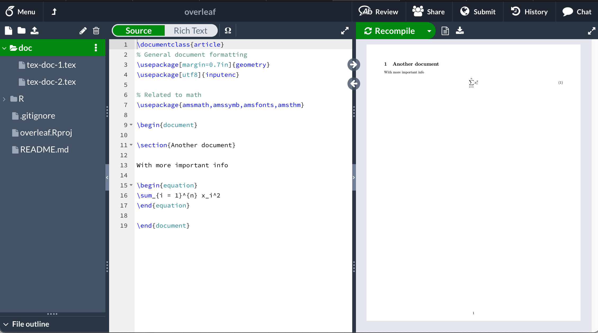

# Overleaf and Git/GitHub


## 1. Initial Setup - RStudio

This is first an RStudio project (created using File -> New Project).

It uses Git for version control (box checked when project created, but could be added with `usethis::use_git()`).

It has some R code in `R/`.

It has some LaTeX documents in `doc/`.

On initial commit the project looked like:
```
├── R
│   └── stuff.R
├── README.md
├── doc
│   ├── tex-doc-1.tex
│   └── tex-doc-2.tex
└── overleaf.Rproj
```

## 2. Put on GitHub

```
usethis::use_github()
```

https://github.com/cwickham/overleaf

## 3. Sync with Overleaf

On Overleaf: New Project -> Import from GitHub
Required linking GitHub account with Overleaf

Looks like this in Overleaf:



